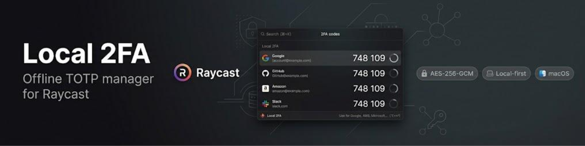
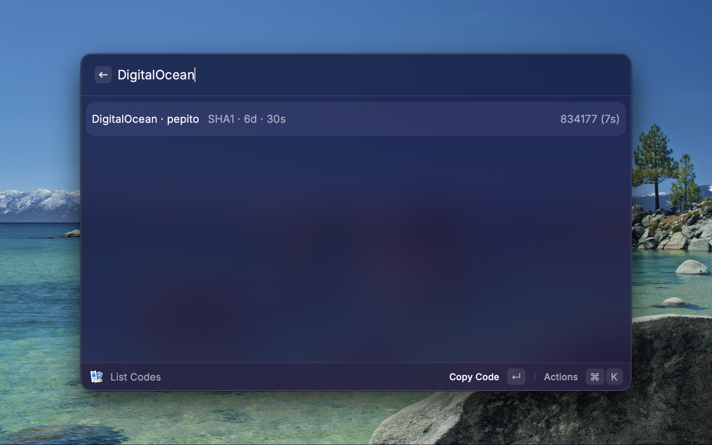
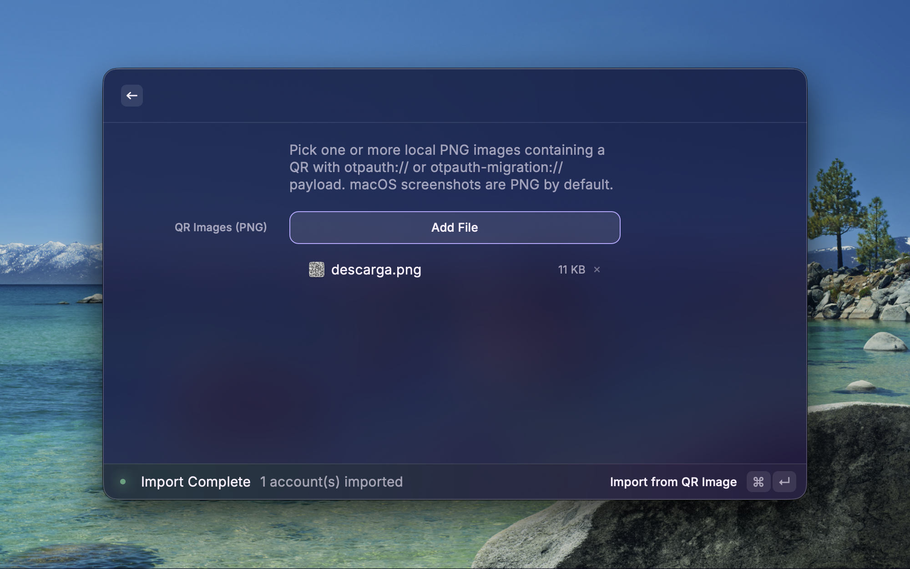
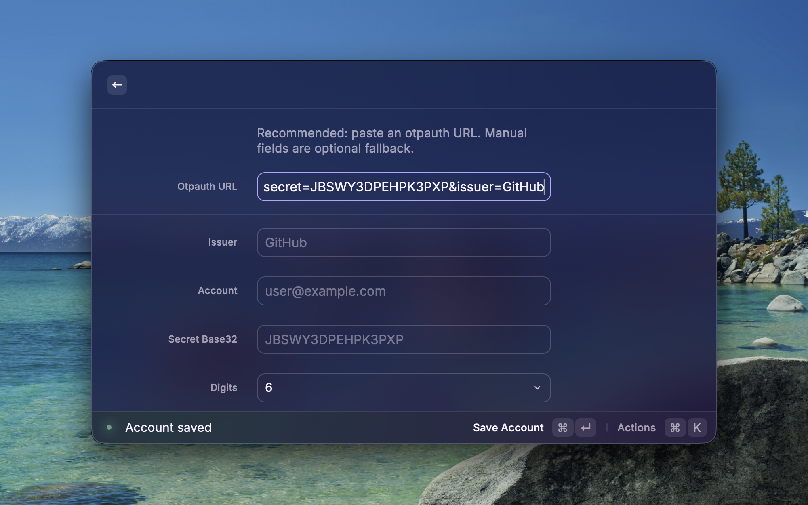

<p align="center">
  
</p>

# Local 2FA pour Raycast

<p align="center">
  Gestionnaire 2FA TOTP local-first et hors-ligne pour Raycast sur macOS.
</p>

<p align="center">
  <a href="../../README.md">English</a> ·
  <a href="./README.es.md">Español</a> ·
  <a href="./README.pt-BR.md">Português (BR)</a> ·
  <a href="./README.de.md">Deutsch</a> ·
  <a href="./README.fr.md">Français</a>
</p>

<p align="center">
  <a href="https://github.com/vayaSEO/local-2fa/releases"></a>
  <a href="https://github.com/vayaSEO/local-2fa/blob/main/LICENSE"></a>
  <a href="https://github.com/vayaSEO/local-2fa/actions/workflows/ci.yml"></a>
  =20" />
  
  
</p>

> Projet personnel open-source. Sans audit indépendant.

---

## Aperçu

<p align="center">
  
</p>

<p align="center">
  
</p>

<p align="center">
  
</p>

## Pourquoi ce projet

- Garder vos secrets 2FA en local sur votre Mac.
- Éviter la synchronisation cloud et les services OTP externes.
- Workflow natif Raycast rapide pour le copier/coller quotidien.

## Fonctionnalités

- Génération TOTP RFC 6238 (`SHA1`, `SHA256`, `SHA512`)
- 6 ou 8 chiffres, période configurable
- Stockage local chiffré (`AES-256-GCM`)
- Import local depuis :
  - URL `otpauth://`
  - URL `otpauth-migration://` (export Google Authenticator)
  - Images QR au format PNG (décodées localement, JS pur, sans binaire externe)

## Commandes

- **List Codes** — voir, copier, coller et supprimer des comptes
- **Add Account** — flux unifié :
  - coller une URL `otpauth://`
  - remplir automatiquement les champs depuis l'URL
  - ou saisir les champs manuellement
- **Import Google Migration** — coller `otpauth-migration://...`
- **Import from QR Image** — choisir une ou plusieurs images QR PNG locales

## Démarrage rapide

Pour l'usage normal, vous n'avez besoin que de Raycast + l'extension installée.

```bash
npm install
npm run lint
npm test
npm run dev
```

## Prérequis

- macOS
- Raycast
- Node.js 20+

Aucun binaire externe requis. `Import from QR Image` décode les PNG en
JavaScript pur (`qr` + `pngjs`). Réexportez vos QR en PNG s'ils sont dans
un autre format.

## Modèle de sécurité (résumé)

- Chiffrement : `AES-256-GCM`
- KDF : `PBKDF2-SHA256` (600 000 itérations, OWASP 2023)
- Salt : 16 octets aléatoires par sauvegarde
- IV : 12 octets aléatoires par sauvegarde
- Master password : préférence `password` Raycast (stockée par Raycast dans macOS Keychain)
- Versionnement du chiffrement : v2 actuel, rétrocompatibilité transparente avec les vaults v1 (210k iter)

Modèle de menaces complet dans [SECURITY.md](../../SECURITY.md).

## Avertissement de récupération

Si vous perdez votre Master Password, les données chiffrées ne peuvent pas être récupérées.
Conservez toujours :

- les codes de récupération de chaque service
- les secrets / payloads QR d'origine
- une sauvegarde séparée de vos identifiants

## Limitations

- Pas de sync cloud (par conception)
- Pas de sync multi-appareil (par conception)
- Pas encore d'export de comptes

## Contribuer

1. Forkez ou clonez.
2. Créez une branche.
3. Lancez `npm run lint && npm test && npm run build`.
4. Ouvrez une PR avec un résumé clair du changement.

Workflow mainteneur : [MAINTAINERS.md](../../MAINTAINERS.md).

## Signalement de vulnérabilités

N'ouvrez pas d'issues publiques pour les vulnérabilités de sécurité.
Utilisez [GitHub Security Advisories](https://github.com/vayaSEO/local-2fa/security/advisories/new)
ou contactez `contacto@davidsitjes.com` en privé.

## Licence

MIT. Voir [LICENSE](../../LICENSE).
